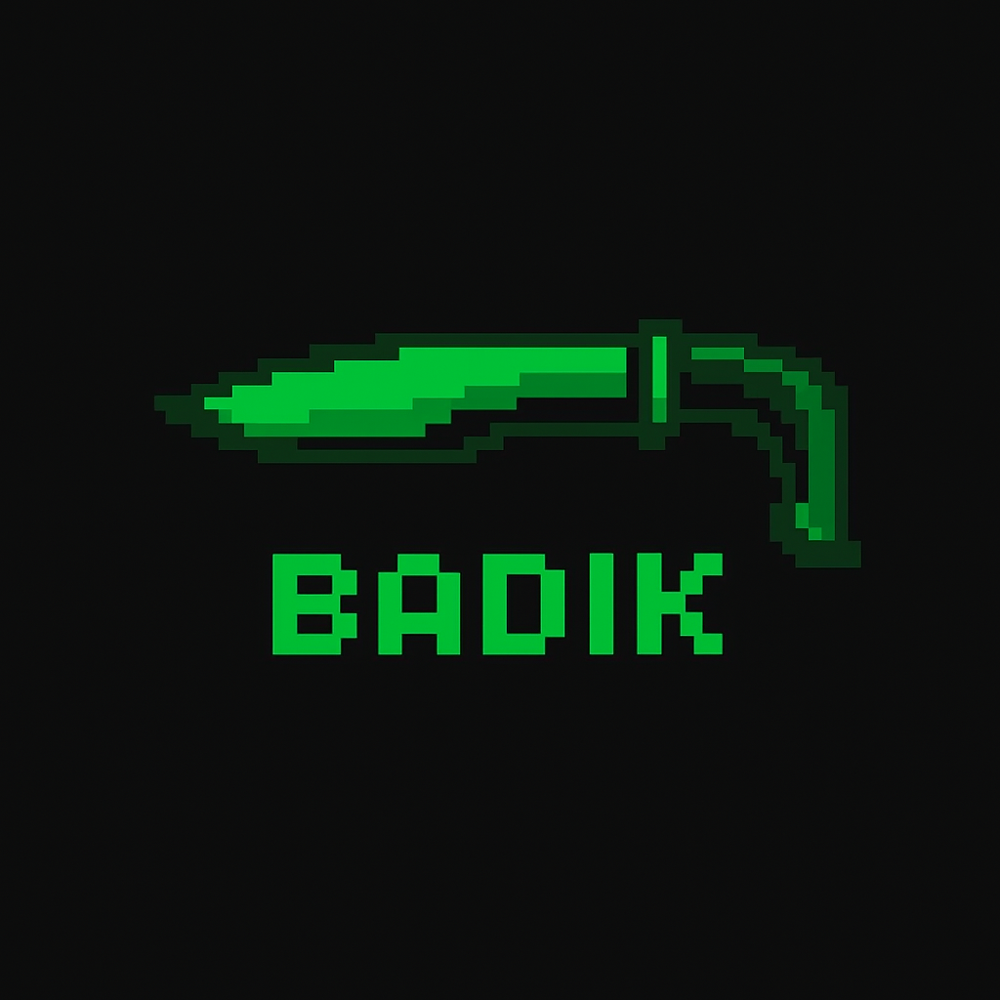

<h1>BADIK</h1>

**Modern offensive security toolkit — built for precision, speed, and real‑world practicality.**

`Cut clean. Move fast. Stay sharp.`

 

 

---

## 🔥 What is BADIK?

**BADIK** is an open offensive security platform providing web-based tools for reconnaissance, scanning, fuzzing, workflow automation, and AI-assisted security testing.

It is designed for **red teams**, **AppSec engineers**, and **researchers** who need **fast**, **repeatable**, and **controlled** testing workflows.

---

## 🧩 Key Features

- **Web-based interface** with a clean, responsive layout
- **High-performance backend** with a modular architecture
- **AI-assisted test generation & triage**
- **Isolated execution environment** for safe offensive testing
- **Automated workflows & pipelines**
- **Pluggable tools & extensible architecture**
- **Exportable reports** in multiple formats
- **CI/CD-friendly integrations**

---

## 🛠 Core Tools (Initial Set)

- **Recon Engine**: subdomain enumeration, DNS, HTTP fingerprints
- **Port & Service Scanner**
- **HTTP Fuzzer**
- **Injection Tester**: XSS / SQLi basics
- **Workflow Runner**
- **Result Triage & Deduplication**

---

## 🧠 AI + MCP Vision

BADIK integrates tightly with modern **AI systems** and **secure execution platforms** to automate common security steps while keeping:

- **Human oversight**
- **Reproducibility**
- **Safety & control**

as first-class priorities.

> **Mission:** Accelerate offense — without compromising control.

---

## 🚧 Roadmap (Early Stages)

- [ ] MVP web app
- [ ] Secure sandboxed runner
- [ ] AI orchestration layer
- [ ] Plugin system for external tools
- [ ] Visual workflow editor
- [ ] Export & pipeline integrations
- [ ] Community contributions & documentation

---

## 🤝 Contributing

BADIK is in its **early stages**. If you are interested in offensive security, red teaming, or building secure automation pipelines, your ideas and feedback are welcome.

- **Discussions**: Architecture, threat models, UX for dark/light themes
- **Code**: New plugins, integrations, or improvements to existing modules
- **Docs**: Guides, examples, and real-world playbooks

Stay tuned for contribution guidelines and a more detailed architecture overview.

---

## 🐍 Motto

**Cut clean. Move fast. Stay sharp.**

